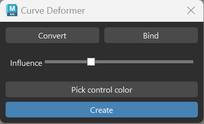

# Curve-Deformer

Description:
Herramienta para crear deformaciones extra en un rig mediante curvas con controladores extra.

Instrucciones:
1.Seleccionar 1 edge loop de una geometría y presionar "Convert".
2: Seleccionar mesh y NURBS creada y presionar botón "Bind".
3.Elegir color de los controles y con la NURBS seleccionada presionar "Create" para finalizar el sistema.
4. Ajustar el dropoff con el slider.
-Para crear otros simplemente se debe seleccionar otra curva y repetir el proceso.

Problemas:

A lo largo del proceso me he encontrado con diversos problemas.

-Al principio tenía pensado utilizar faces en vez de edges para hacerlo más cómodo para el usuario, pero me creaba la NURB en zonas que no corresponden. 
 [faces[i]] for i in range(0, len(faces), 4) + [faces[i+1] for i in range(0, len(faces)-1, 4)] Para filtrar caras y que las NURBS quedasen más espaciadas. Supongo que algo por el camino falló, pero al final descarté la idea.

-Por otro lado, crear el init fue una idea final, ya que por separado no acababa de encontrar bien el main en la carpeta de scripts.

-Me surgieron dudas sobre todo acerca de cómo hacer que el color picker de QT afectase al nativo de maya. (duda la cual resolví preguntándole a la IA, que me informó de que hay un sistema de conversión de colores con un ratio 1 a 255, por lo que al final resultó relativamente fácil implementarlo.

-Acerca del main, sí me causó bastantes problemas, enumero algunos de ellos.
  -Problemas con duplicados de nombre (utilice un sistema para añadir una numeración al final y añadir 1 si hay un objeto nuevo)
  -Slider solo afectaba al primer deformador (variables globales)
  -Slider no afectaba a nada (variables globales y verificación extra)
  -Desorganización)creación de grupos base)
  -Tema manejo de caras a edges verificando que fuesen edge loops(ahora simplemente se seleccionan directamente los edge loops)
  -No funcionaba en más de una curva (variables globales y pequeños ajustes en el manejo de cada objeto)
  -Exceso de controles (ajustar al número de cvs, cálculo con spans y tipo de curva)
  -Comportamiento cíclico( cleanup de las curvas antes de usarlas)

-Hice uso de la ia para comprender mejor algunos procesos, o aprender cómo se hacían cosas que antes no sabía. También para la detección de algún que otro pequeño bug.

Demo de uso:  

